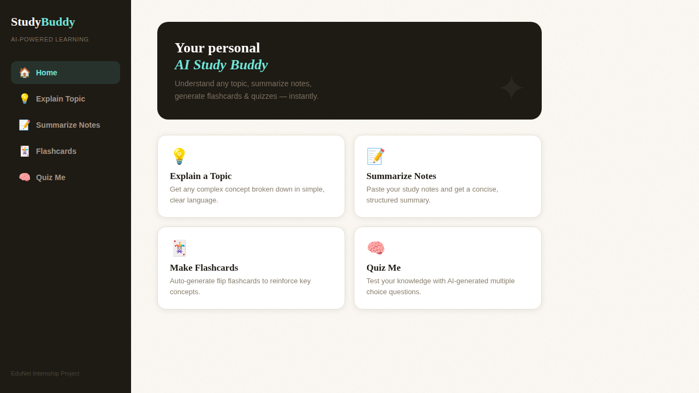
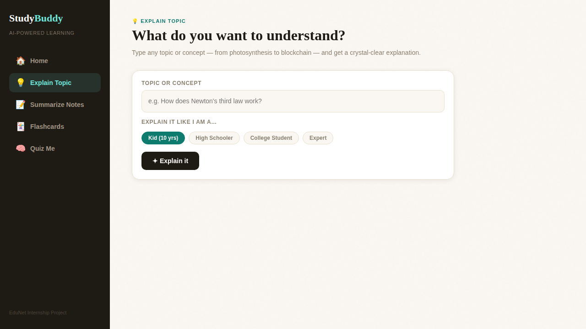
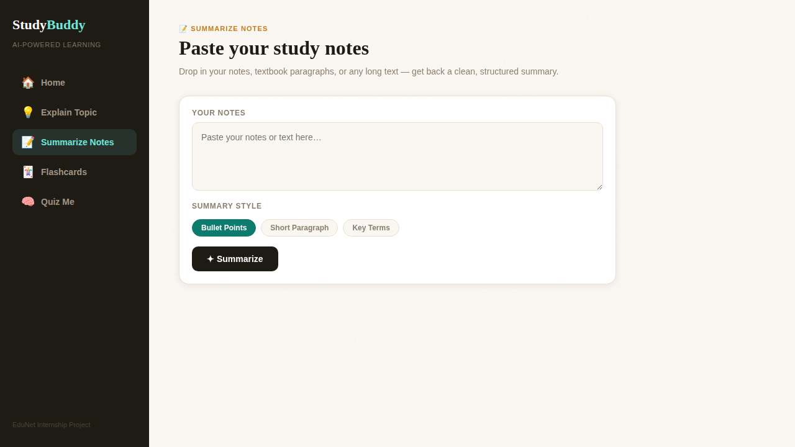
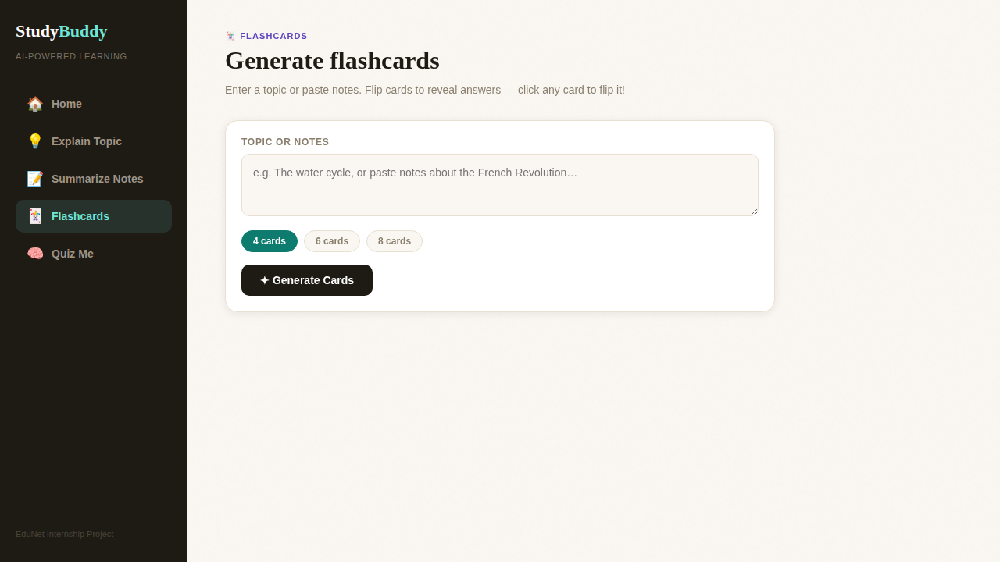
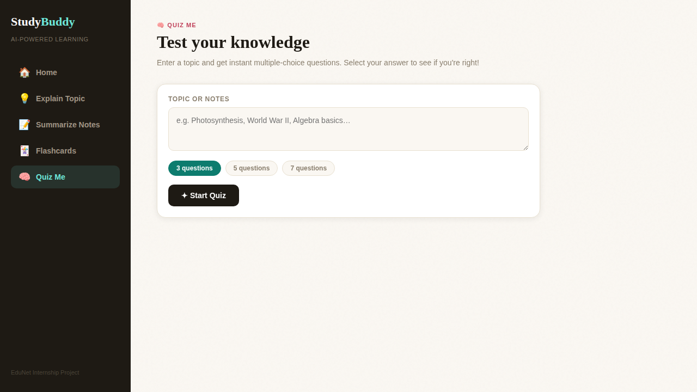

# 📚 AI-Powered Study Buddy

> An intelligent study assistant that explains complex topics, summarizes notes, and generates quizzes & flashcards — powered by AI.



---

## 🎯 Problem Statement

Students often struggle to understand complex concepts while studying independently. Searching online gives long or irrelevant results, and teachers aren't always available. **AI-Powered Study Buddy** solves this by providing instant, personalized academic help on demand.

---

## ✨ Features

| Feature | Description |
|---|---|
| 💡 **Explain Topic** | Get any concept explained at 4 difficulty levels — Kid, High School, College, or Expert |
| 📝 **Summarize Notes** | Paste your notes and receive a clean summary as bullet points, a paragraph, or key terms |
| 🃏 **Flashcards** | Auto-generate 4–8 interactive flip flashcards from any topic or pasted notes |
| 🧠 **Quiz Me** | Get 3–7 multiple-choice questions with instant right/wrong feedback and a final score |

---

## 📸 Screenshots

### 🏠 Home


### 💡 Explain Topic


### 📝 Summarize Notes


### 🃏 Flashcards


### 🧠 Quiz Me


---

## 🗂️ Project Structure

```
ai-study-buddy/
│
├── index.html              # Main HTML — page structure & layout
├── app.py                  # Flask backend — secure API proxy
├── requirements.txt        # Python dependencies
├── .env.example            # Environment variable template
├── .gitignore              # Files excluded from Git
│
├── static/
│   ├── css/
│   │   └── style.css       # All styles — layout, components, animations
│   └── js/
│       └── app.js          # All JavaScript — API calls, UI logic
│
└── screenshots/
    ├── 01_home.png
    ├── 02_explain.png
    ├── 03_summarize.png
    ├── 04_flashcards.png
    └── 05_quiz.png
```

---

## 🛠️ Tech Stack

| Layer | Technology |
|---|---|
| Frontend | HTML5, CSS3, Vanilla JavaScript |
| AI Model | Anthropic Claude (`claude-haiku`) |
| Backend | Python + Flask (API proxy) |
| Streaming | Server-Sent Events (SSE) |
| Deployment | GitHub Pages / Render / Railway |

---

## 🚀 Getting Started

### Option A — Open directly in browser (no backend)

Just open `index.html` in your browser. The app calls the Anthropic API directly from the frontend.

> ⚠️ This exposes API calls in the browser. Use Option B for production.

---

### Option B — Run with Flask backend (recommended)

The Flask backend acts as a secure proxy — your API key stays on the server.

**1. Clone the repository**
```bash
git clone https://github.com/yourusername/ai-study-buddy.git
cd ai-study-buddy
```

**2. Create a virtual environment**
```bash
python -m venv venv
source venv/bin/activate        # Mac/Linux
venv\Scripts\activate           # Windows
```

**3. Install dependencies**
```bash
pip install -r requirements.txt
```

**4. Set up your API key**
```bash
cp .env.example .env
# Open .env and replace with your actual Anthropic API key
```

**5. Run the server**
```bash
python app.py
```

**6. Open in browser**
```
http://localhost:5000
```

---

## 🌐 Deploy on GitHub Pages (frontend only)

1. Push your code to a **public** GitHub repo
2. Go to **Settings → Pages**
3. Set branch to `main`, folder to `/ (root)`
4. Your live URL will be: `https://yourusername.github.io/ai-study-buddy/`

---

## ⚙️ Environment Variables

| Variable | Description |
|---|---|
| `ANTHROPIC_API_KEY` | Your API key from [console.anthropic.com](https://console.anthropic.com) |

Copy `.env.example` → `.env` and fill in your key. **Never commit `.env` to GitHub.**

---

## 🧠 How It Works

```
User Input (topic / notes)
        ↓
Select Mode  →  Explain / Summarize / Flashcards / Quiz
        ↓
Custom Prompt is Built
        ↓
Sent to Claude API  (streaming for text, standard for JSON)
        ↓
Response Parsed
        ↓
Rendered in UI  →  Text / Summary / Flip Cards / MCQ Quiz
```

---

## 🔮 Future Scope

- 🎙️ Voice input/output for hands-free studying
- 🌐 Multi-language support for regional accessibility
- 📄 Upload PDF or image notes for AI summarization
- 🔁 Spaced repetition flashcard review scheduler
- 👤 User accounts with progress & score history
- 🏫 LMS integration (Google Classroom, Moodle)

---

## 🙌 Acknowledgements

- [Anthropic](https://www.anthropic.com) — Claude AI API
- [Flask](https://flask.palletsprojects.com) — Python web framework
- [MDN Web Docs](https://developer.mozilla.org) — Frontend reference
- EduNet Foundation — Internship Program

---

## 👩‍💻 Author

**Rohnit Jethwa**
- 🏫 College: SMIT | Department: IT
- 📌 EduNet Internship — Capstone Project
- 🔗 GitHub: [@flash-sagittario](https://github.com/flash-sagittario)

---
---
